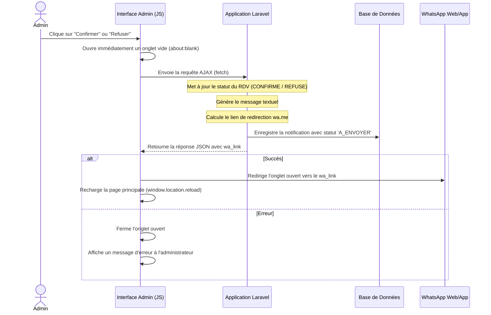

# Spécifications Logiques : Notification WhatsApp Manuelle (wa.me) - Version Unifiée

Ce document décrit l'architecture logique de la fonctionnalité d'envoi des notifications WhatsApp aux clients en **un seul clic**, conçue comme une alternative gratuite et sans contrainte technique à l'API WhatsApp Cloud officielle.

---

## 1. Contexte & Contraintes
- **Problématique** : L'envoi automatique via l'API officielle nécessite un compte Meta Business vérifié et des modèles de messages approuvés.
- **Solution** : Unification des étapes. L'administrateur clique sur "Confirmer" (ou "Refuser"). L'application effectue la mise à jour en base de données via AJAX, tout en ouvrant et redirigeant simultanément un nouvel onglet vers le lien WhatsApp pré-rempli (`https://wa.me/`).
- **Emails** : Désactivés conformément aux spécifications ("pas de mail").

---

## 2. Flux Logique de l'Application

---

## 3. Composants et Rôles

### A. Contrôleur Admin : [AdminController.php](file:///c:/Users/fallou/projet%20laravel/couture-app/app/Http/Controllers/AdminController.php)
- **`rendezvousConfirmer($id)` & `rendezvousRefuser($id)`** : Mettent à jour le statut du rendez-vous, rédigent le message personnalisé, appellent `sendAppointmentNotifications(...)` et détectent si la requête est AJAX (`wantsJson()`). Si oui, ils retournent directement le lien `wa_link` en format JSON.

### B. Vues Administrateur (Interactions JS)
- **Liste des rendez-vous** : [index.blade.php](file:///c:/Users/fallou/projet%20laravel/couture-app/resources/views/admin/rendezvous/index.blade.php)
- **Détails d'un rendez-vous** : [show.blade.php](file:///c:/Users/fallou/projet%20laravel/couture-app/resources/views/admin/rendezvous/show.blade.php)
  - Les boutons de confirmation et de refus ont la classe `btn-ajax-action` et stockent le message de confirmation dans `data-confirm-msg`.
  - Un script JS écoute le clic sur ces boutons :
    1. Affiche un dialogue de confirmation.
    2. Ouvre un onglet vide (`window.open('about:blank', '_blank')`) de manière synchrone pour contourner le bloqueur de popups.
    3. Exécute l'appel `fetch` en arrière-plan.
    4. En cas de succès, redirige l'onglet et recharge la page. En cas d'échec, ferme l'onglet et affiche l'erreur.
