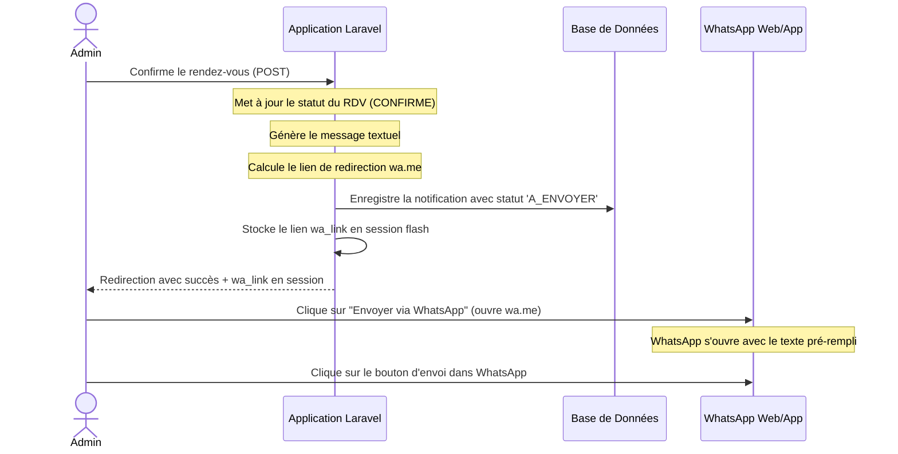

# Spécifications Logiques : Notification WhatsApp Manuelle (wa.me)

Ce document décrit l'architecture logique de la fonctionnalité d'envoi manuel des notifications WhatsApp aux clients, conçue comme une alternative gratuite et sans contrainte technique à l'API WhatsApp Cloud officielle.

---

## 1. Contexte & Contraintes
- **Problématique** : L'envoi automatique via l'API officielle nécessite un compte Meta Business vérifié et des modèles de messages approuvés, ce qui n'est pas disponible pour l'environnement actuel.
- **Solution** : Utiliser le protocole de redirection standard de WhatsApp (`https://wa.me/`) pour pré-remplir les messages sur le terminal de l'administrateur, lui permettant de valider l'envoi en un clic via son propre compte (WhatsApp Web ou application).
- **Emails** : Désactivés conformément aux spécifications ("pas de mail").

---

## 2. Flux Logique de l'Application

---

## 3. Composants et Rôles

### A. Contrôleur Admin : [AdminController.php](file:///c:/Users/fallou/projet%20laravel/couture-app/app/Http/Controllers/AdminController.php)
- **`rendezvousConfirmer($id)` & `rendezvousRefuser($id)`** : Mettent à jour le statut du rendez-vous, rédigent le message personnalisé, et appellent `sendAppointmentNotifications(...)`.
- **`sendAppointmentNotifications(...)`** :
  - Calcule le lien de redirection `https://wa.me/{telephone}?text={message}`.
  - Sauvegarde ce lien dans la session flash : `session()->flash('wa_link', $waLink)`.
  - Enregistre une instance du modèle `Notification` avec le statut `'A_ENVOYER'` pour l'historique de suivi.

### B. Vues Administrateur (Blade templates)
- **Liste des rendez-vous** : [index.blade.php](file:///c:/Users/fallou/projet%20laravel/couture-app/resources/views/admin/rendezvous/index.blade.php)
  - Intercepte la session flash `success` et `wa_link` pour afficher le bouton d'action principal d'envoi immédiat.
  - Dynamise les icônes WhatsApp de chaque ligne pour pré-remplir le message exact selon le statut actuel du rendez-vous.
  - Affiche un badge orange **"À envoyer"** pour les notifications de statut `A_ENVOYER`.
- **Détails d'un rendez-vous** : [show.blade.php](file:///c:/Users/fallou/projet%20laravel/couture-app/resources/views/admin/rendezvous/show.blade.php)
  - Affiche également le bouton vert dans le bandeau de succès.
  - Affiche un bouton d'action rapide **"Envoyer maintenant"** dans l'historique des notifications pour tous les messages au statut `A_ENVOYER`.
  - Adapte les alertes d'étapes finales (confirmé/refusé) pour rappeler à l'administrateur de procéder à l'envoi manuel si nécessaire.
